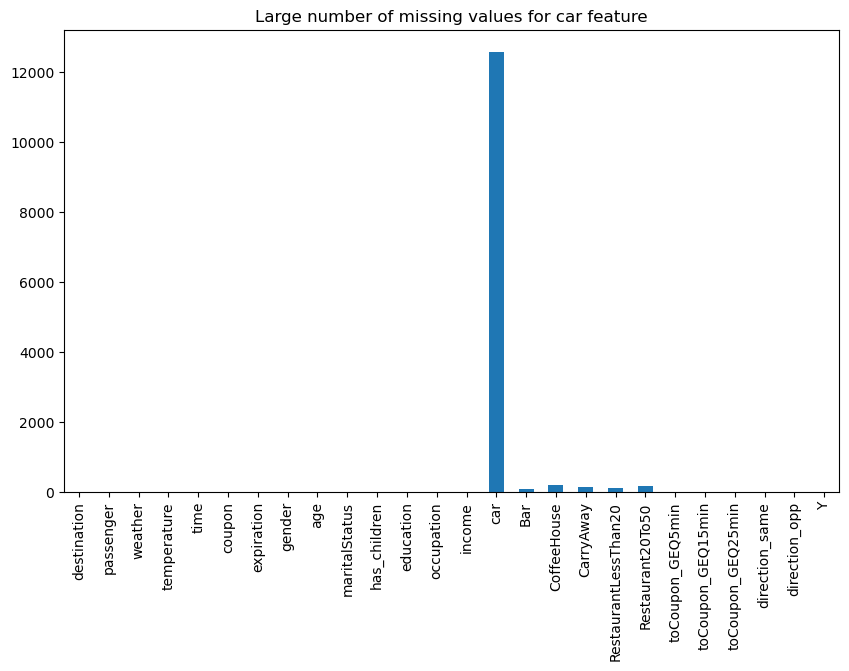
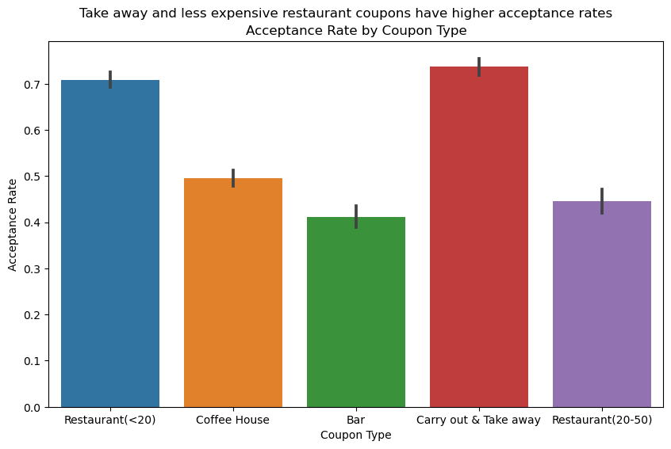
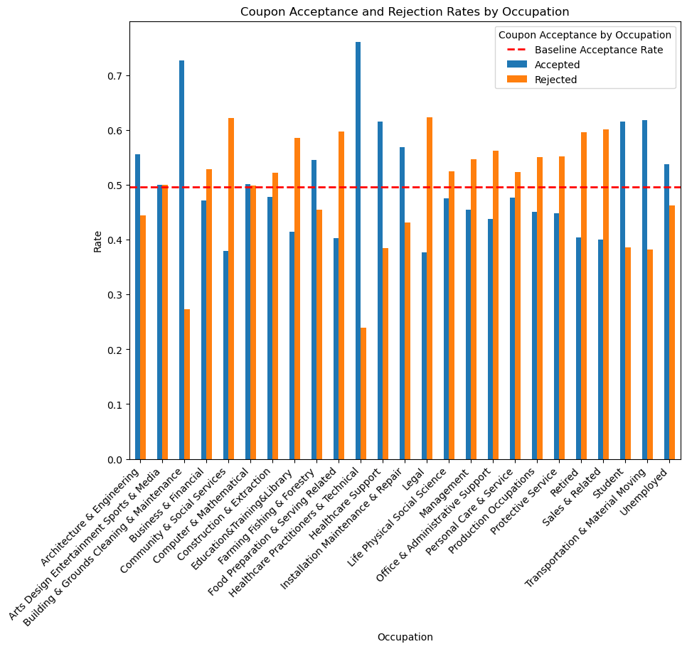
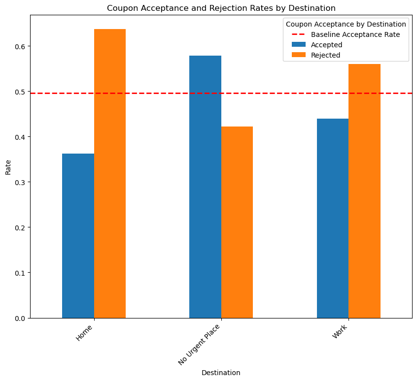
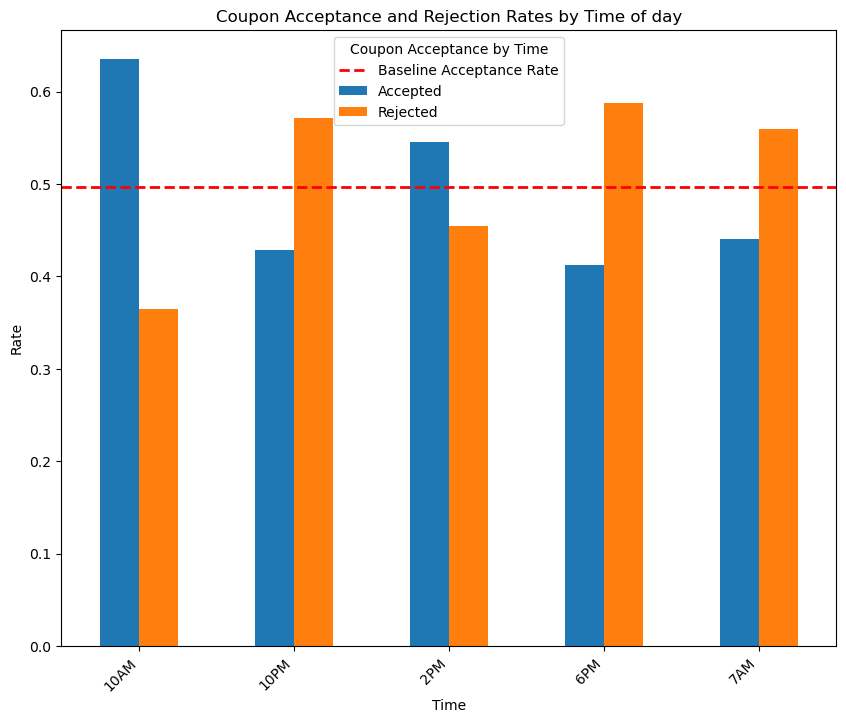
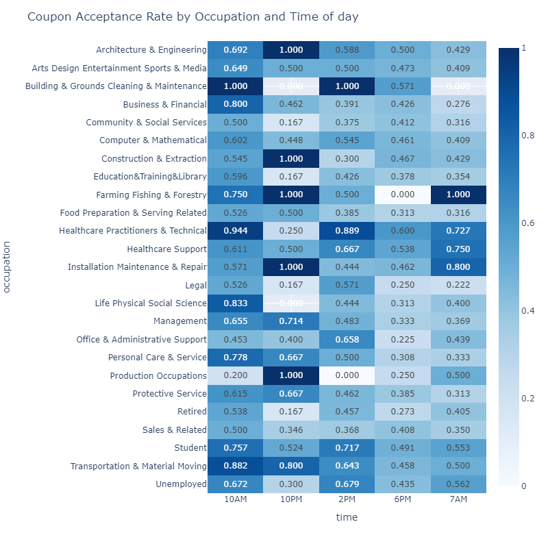
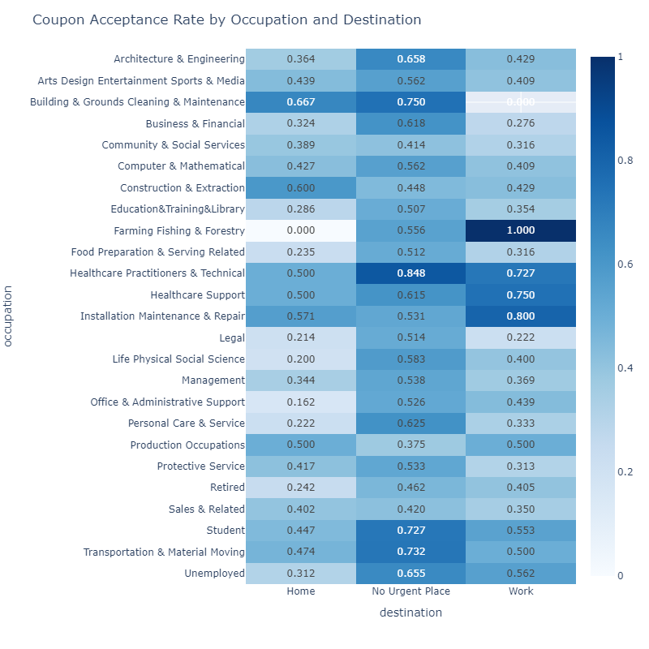

# Practical-Assignment-Module5 

## practical application 1.ipyng - main Jupyter notebook

## [link to public github repo containing code](https://github.com/mnazers734/Practical-Application-Module5)

## Data Analysis and Cleaning

### The barplot below shows a large number of missing values for the cars feature. 

### Since over 90 percent of the samples are missing for the 'car' feature, this column will be dropped. For other features with missing values, the total number of missing values was very small compared to the total number of samples, so these values can be removed without affecting the outcome of the data analysis. Also, the misspelled 'passanger' column was renamed 'passenger'

## Statistical Analysis

### Since most the features in the dataset are categorical, the mode is the only valuable descriptive statistical value. The mode for the categorical features is shown below:
#### Modes of Categorical Features:  
destination:          No Urgent Place  
passenger:            Alone  
weather:              Sunny  
time:                 6PM  
coupon                Coffee House  
expiration:           1d  
gender:               Female  
age:                  21  
maritalStatus:        Married partner  
education:            Some college - no degree  
occupation:           Unemployed  
income:               $25000 - $37499  
Bar:                  never  
CoffeeHouse:          less1  
CarryAway:            1~3  
RestaurantLessThan20: 1~3  
Restaurant20To50:     less1  

### Analysis of drivers who accepted coupons of type Coffee House
### Findings Based on Barcharts and Heatmaps
The baseline acceptance rate for coffee house coupons is 49.63%.  
Drivers who visit coffee houses more than three times a month have a higher acceptance rate (67.26%) compared to those who visit less frequently (44.59%).  
Occupations such as "Healthcare Practitioners & Technical" and "Healthcare Support" have higher acceptance rates compared to other occupations.  
Drivers heading to "No Urgent Place" have a higher acceptance rate (57.82%) compared to those heading to "Home" (36.26%) or "Work" (44.00%).  
The acceptance rate is highest at 10AM (63.48%) and lowest at 10PM (42.91%).  

  

### Comparing Occupation and Time of Day together
The heatmap of acceptance rate based on occupation and time of day shows that certain occupations have much higher acceptance rates at specific times of the day - such as, "Healthcare Practitioners & Technical" have higher acceptance rates in the morning (10AM) compared to other times.  

### Comparing Occupation and destination together
The heatmap of acceptance rate based on occupation and destination of day shows that certain occupations have much higher acceptance rates at specific times of the day. For example, "Farming Fishing & Forestry" and "Healthcare Practitioners & Technical" have higher acceptance rates when traveling to work than other occupations even though the "No Urgent Place" destination had the highest overall acceptance rate. 

## Final Recommendations
Targeting drivers who visit coffee houses frequently, especially those in healthcare-related occupations or heading to non-urgent destinations, can improve the acceptance rate. Additionally, offering coupons in the morning (10AM) may yield better results. Drivers who are coming home and coupons offered in the evening at 6pm had overall lower acceptance rates. This group is an opportunity for growth and could be targeted with more attractive offers. 
